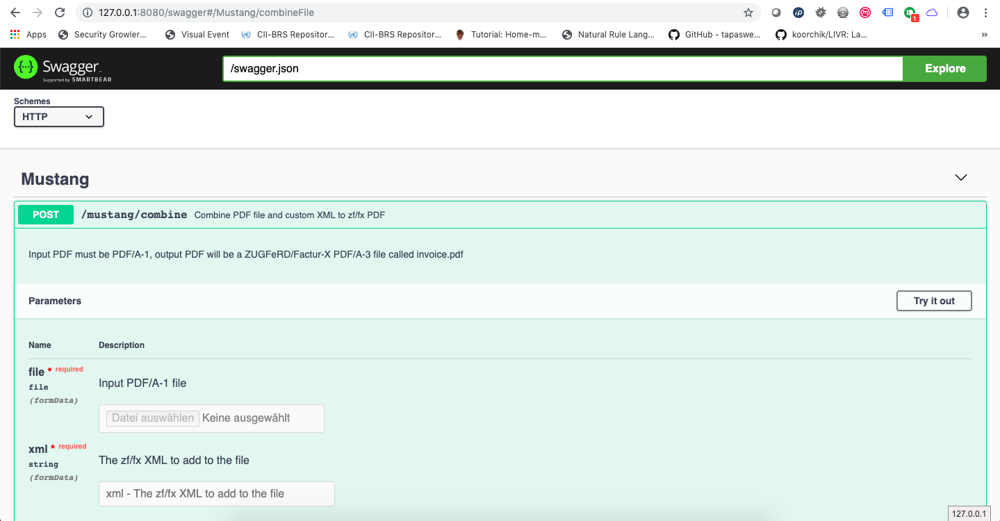

# mustangAPI
A rest API for [Mustangproject](https://www.mustangproject.org), i.e. for ZUGFeRD/Factur-X

## Architecture

Using a
 * [Dropwizard](https://dropwizard.io) and a 
 * Swagger integration
 
Recommended: German 45min Dropwizard/Swagger introduction [video](https://media.ccc.de/v/froscon2017-1985-einfache_rest-apis_mit_dropwizard_und_swagger) and [slides](https://programm.froscon.de/2017/system/event_attachments/attachments/000/000/469/original/20170818_LeanIX_Presentation_Froscon.pdf) from Froscon 2017
 
## Features

 * Integrates its own (jersey) webserver
 * get the API documentation online (Human readable and as OpenAPI)
 * try the API in a swagger generated demo web client
 * Extract the XML from a ZUGFeRD/Factur-X invoice
 * Combine custom XML and a PDF/A-1 file to a ZUGFeRD/Factur-X invoice
 
Feel free to send pull requests for more functionality. 

## Compile

`mvn clean package`

## Start

`java -jar target/server-0.0.2-SNAPSHOT.jar server config.yml` 

## Use

use http://127.0.0.1:8080/swagger to try the methods (https://localhost:8443/swagger would work but is self-signed).
Access http://localhost:8080/swagger.yaml to build your clients.
For demo purposes, extract does not require authentication but combine requires http authentication with user name "good-guy" and password "secret".

## Support

Community support is available via the [ZUGFeRD Google Group](https://groups.google.com/forum/?hl=de#!forum/zugferd)

## Contact

For commercial and/or legal inquiries contact Jochen Stärk jochen@zugferd.org
